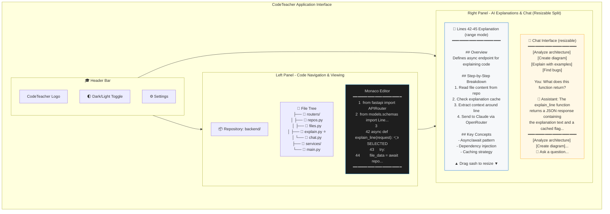
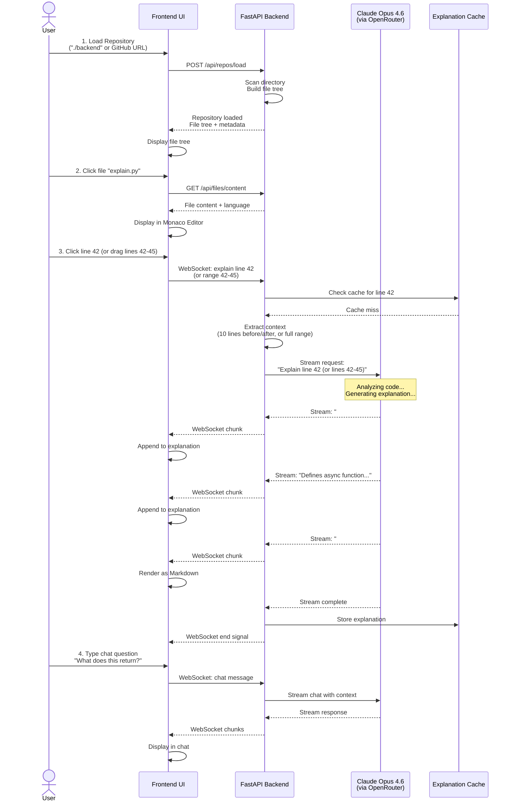
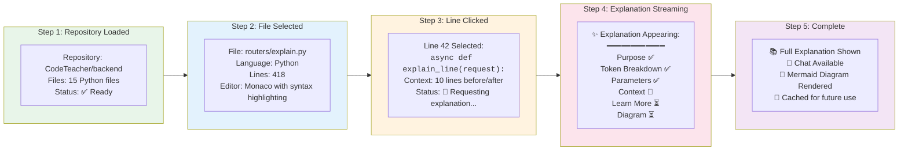
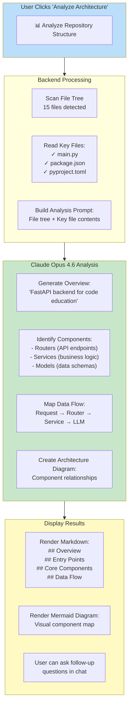
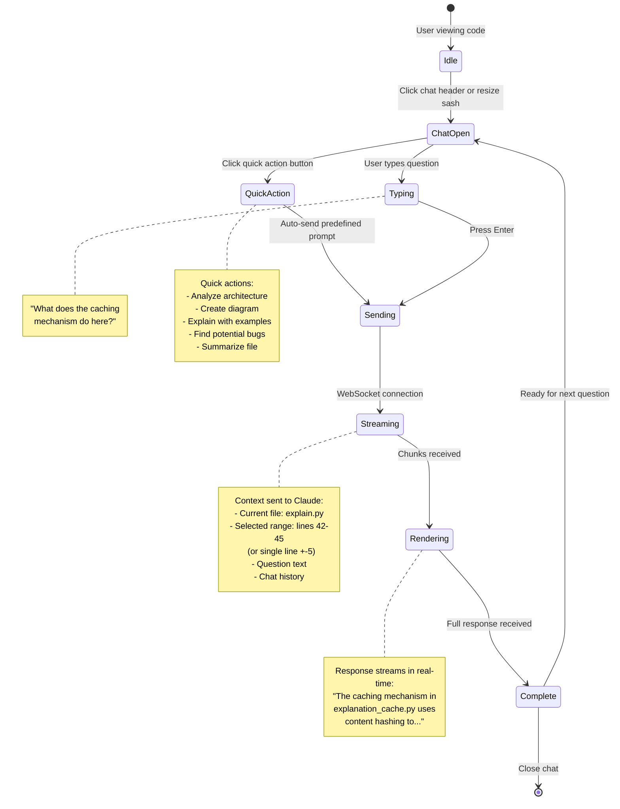
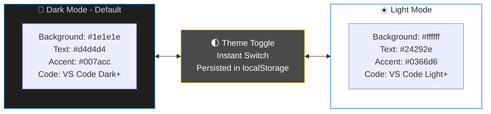

# CodeTeacher - System in Operation

## Application Interface Layout



## User Interaction Flow



## Example Session: Explaining Python Code



## Architecture Explanation Feature



## Chat Feature in Action



## Visual Theme Comparison



## Real-Time Streaming Visualization

```mermaid
gantt
    title Code Explanation Timeline (Real-Time Streaming)
    dateFormat SSS
    axisFormat %Lms

    section User Action
    Click line 42           :done, click, 000, 50ms

    section Backend
    Check cache             :done, cache, 050, 30ms
    Extract context         :done, context, 080, 40ms
    Build prompt            :done, prompt, 120, 30ms
    Send to Claude          :done, send, 150, 50ms

    section Claude Processing
    Analyze code            :active, analyze, 200, 800ms
    Generate response       :active, generate, 1000, 2000ms

    section UI Updates
    Show loading            :done, loading, 050, 200ms
    Stream Purpose          :done, p1, 250, 300ms
    Stream Token Breakdown  :done, p2, 550, 500ms
    Stream Context          :done, p3, 1050, 400ms
    Stream Learn More       :done, p4, 1450, 300ms
    Render Diagram          :done, p5, 1750, 500ms
    Complete                :milestone, done, 2250, 0ms
```

---

## Summary

This visualization shows CodeTeacher in operation with:

1. **Split-panel interface** - Code on left, explanations on right (resizable)
2. **Interactive file tree** - Click any file to view
3. **Line-by-line explanations** - Click any line for AI explanation
4. **Multi-line range explanations** - Click and drag to explain code blocks
5. **Real-time streaming** - See explanations appear progressively
6. **Resizable chat panel** - Drag sash to expand chat up to ~2/3 of right panel
7. **Quick action buttons** - One-click prompts for architecture, diagrams, examples, bugs, summaries
8. **Context-aware chat** - Ask follow-up questions with line/range context
9. **Visual diagrams** - Mermaid charts for complex concepts
10. **Architecture analysis** - High-level project understanding
11. **Dark/Light themes** - User preference support

The system provides an educational experience that makes code comprehension accessible through AI-powered explanations optimized for learning.
